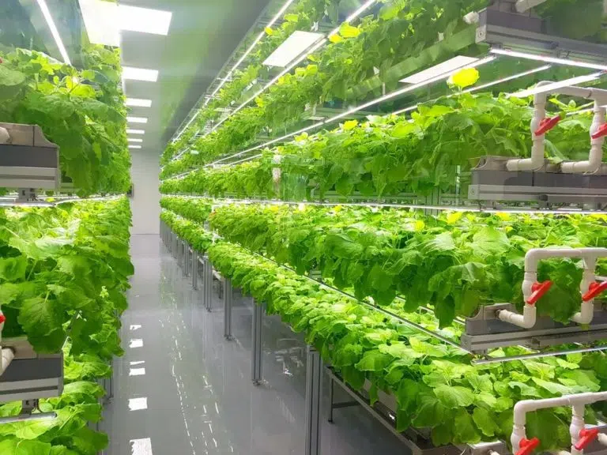

<p align="center">
  
</p>

<p align="center">
  🌐 <b>Live Demo:</b>
  <a href="https://shreyashv1965.github.io/Farmers-Info-Hub/">Farmers Info Hub</a>
</p>

---

# 🌾 Farmers Info Hub

Farmers Info Hub is a web-based platform designed to support farmers and agriculture enthusiasts by providing information on modern farming techniques, sustainable agriculture practices, and agricultural tools. The project focuses on making farming knowledge easily accessible using simple and user‑friendly web technologies.

It helps users understand **technology‑driven and sustainable farming practices** in an easy, visual, and interactive way.

---

## ✨ Features

- 🌱 Information on modern farming techniques  
- ♻️ Focus on sustainable agriculture practices  
- 🖼️ Image slideshow highlighting farming concepts  
- 🔍 Search functionality for quickly finding relevant information  
- 📱 Responsive design for mobile, tablet, and desktop devices  
- 🎓 Educational content aimed at farmers and learners  

---

## 🛠️ Technologies Used

- **HTML5** – Structure of the website  
- **CSS3** – Styling and responsive design  
- **JavaScript** – Interactivity and search functionality  

---

## 🎯 Project Objective

The objective of Farmers Info Hub is to create a simple yet informative platform that helps farmers learn about modern and sustainable farming practices. The project aims to raise awareness about agriculture technologies and encourage smart farming methods using easily accessible information.

---

## 📸 Screenshots

<p align="center">
  
</p>

---

## 🚀 Getting Started

Follow these steps to run the project locally.

### 📥 Clone the Repository
```bash
git clone https://github.com/shreyashv1965/Farmers-Info-Hub.git
